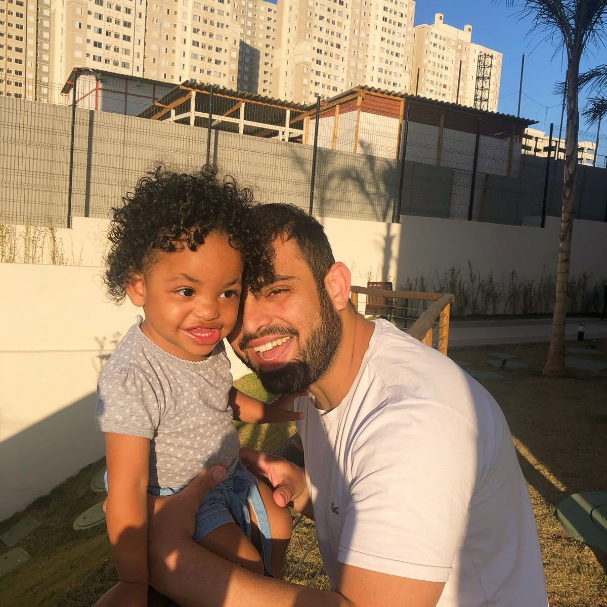
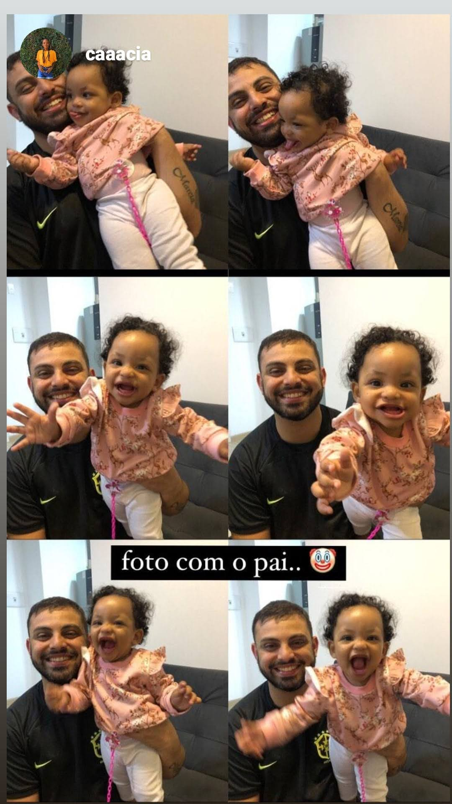

# Conexão, Laços & Memórias

Site memorial em formato de linha do tempo, criado para eternizar as memórias da nossa família. Cada seção é um capítulo com fotos em carrossel.

🔗 **Site no ar:** https://brunomiranda-dev.github.io/lacos-e-memorias/

## 01 - Sobre o Projeto

O projeto nasceu como uma homenagem para a Alicia. É um site One-Page (página única) onde cada memória da família tem seu próprio carrossel de fotos.

> Exemplo de memórias: Primeira Rosa, Minha Família - Brincadeiras em Família, Passeios, etc.

## 02 - Tecnologias Utilizadas

- **HTML5** - Estrutura semântica com `header`, `main`, `section`, `footer`
- **CSS3** - Estilização, centralização com Flexbox e paleta rosa
    - `display: flex`, `justify-content: center`, `align-items: center`
    - Cores: `#fff5f7` (fundo), `#d81b60` (títulos), `#f8bbd0` (botões)
- **JavaScript Puro (Vanilla JS)** - Lógica dos carrosseis sem biblioteca
- **Git & GitHub Pages** - Versionamento e hospedagem gratuita

## 03 - Como Funciona

O site é todo em um único arquivo `index.html`.

Cada memória segue esse padrão:
```html
<section class="carrossel">
  <h2>6. Minha Família</h2>
  <h3>Brincadeiras em Família</h3>
  <div class="area-fotos">
    <button class="voltar">&#10094;</button>
    <div class="fotos">
      
      
    </div>
    <button class="avancar">&#10095;</button>
  </div>
</section>

## 04 - Como Rodar
```bash
git clone https://github.com/Brunomiranda-dev/lacos-e-memorias.git

## 05 - Estrutura
static/foto1.jpeg ... foto90.jpeg
README.md
index.html
style.css

##06 - O Que Aprendi
Centralizar de verdade com Flexbox
Criar carrossel infinito com operador %
Hospedar site com GitHub Pages

##07 - AutorDesenvolvido Bruno Miranda
GitHub: @Brunomiranda-dev
LinkedIn: www.linkedin.com/in/brunomiranda-dev
E-mail: brunomirandamp@hotmail.com

